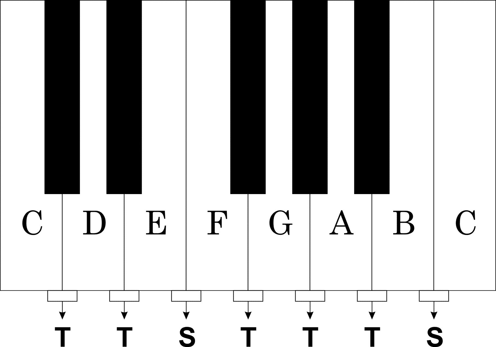

## 1. Introdução

C# é uma das linguagens de programação que eu particularmente mais gosto, fui facilmente cativado quando a experimentei. Entretanto, antes mesmo de usá-la havia um detalhe que chamava bastante a minha atenção: o nome.

C♯ é um símbolo afamado no âmbito musical, qualquer musicista é capaz de reconhecer o famigerado dó sustenido.

Ok, mas o que raios é um dó sustenido? (╯°□°）╯︵ ┻━┻

Antes de responder essa pergunta, permita-me falar um pouco sobre auto-incremento para termos um pouco de contexto.

## 2. Operadores de auto-incremento

No contexto computacional, o operador ++ representa auto-incremento. Podemos fragmentar o auto-incremento em duas categorias distintas: pré-incremento e pós-incremento.

O pré-incremento ocorre quando usamos o operador de auto-incremento antes da variável. Por consequência, o incremento é efetuado de imediato, previamente ao restante da instrução vigente:

```csharp
byte value = 1;

WriteLine(++value) // 2
```

O pós-incremento, no entanto, é realizado posteriormente ao restante da instrução vigente, afinal o operador de auto-incremento é declarado depois da variável:

```csharp
byte value = 1;

WriteLine(value++) // 1

// Somente após a instrução vigente se torna 2
WriteLine(value) // 2
```

O conceito de auto-incremento é usado no nome do C++. Da a entender que é um C incrementado, um C com extensão a orientação a objetos.

Muito bem, com isto esclarecido podemos enfim ir para o contexto musical.

## Tom, semitom, sustenido e bemol

Apesar de nem todos se interessarem por música, eu arrisco dizer que muita gente conhece a escala de dó maior: C (dó), D (ré), E (mi), F (fá), G (sol), A (lá), B (si).

Com essa escala podemos entender um pouquinho sobre tom e semitom. Considere a seguinte parte deste piano hipotético:



De uma tecla branca para outra branca temos um tom, com exceção de E para F e de B para C, neste caso temos semitom.

Entretanto, ainda temos as teclas pretas. Elas representam sustenidos e bemóis. Assim como de E para F temos um semitom, temos também um semitom entre C e D por exemplo, por isso a tecla preta entre elas. Portanto:


O ♯ (sustenido) indica que a nota deve ser elevada em meio tom. Por exemplo, F# é uma nota mais alta que F, porém não é mais alta que G, pois esta entre F e G. Já o ♭ (bemol) informa que uma nota deve ser abaixada em meio tom, logo A♭ é mais baixo que A, mas continua sendo mais alto que G.

Há, inclusive, uma piada (que tem nexo somente em inglês) com sentido musical:

Why C# is called C-sharp? To give the opportunity to C-sharp-haters to call it D-flat (D♭)

## Conclusão

Enfim, C++ usou o auto-incremento para representar a ideia de um C melhorado e o C# fez o mesmo, entretanto, através do sustenido. Na língua inglesa esse detalhe é mais obvio, pois dó sustenido é pronunciado como c-sharp, assim como a linguagem de programação.

Mas confesso que em português seria muito estranho eu falar que programo em dó sustenido, pior ainda seria traduzi-lo como c-cerquilha, eu prefiro nem imaginar.